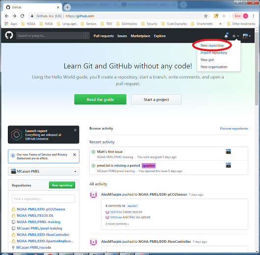
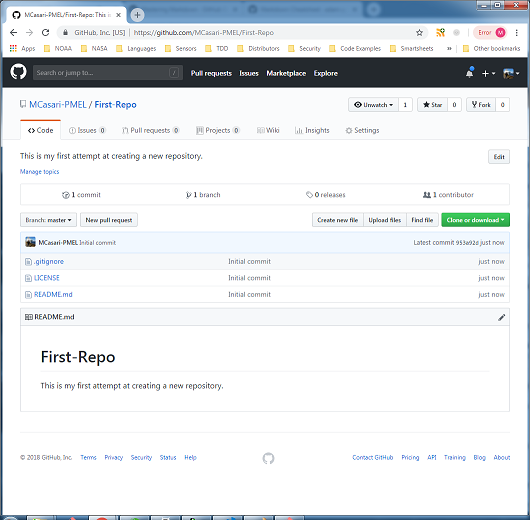

# GitHub Training - Hands-on Workshop
Matt Casari 
NOAA/PMEL/EDD 
matthew.casari@noaa.gov

## Overview
This training is split up into the following subsections:

1. GitHub Website and Navigation
    1. User Site vs. NOAA-PMEL
    2. Your Profile
    3. Settings
2. Working in an existing repository
    1. Create and commit a file in a repo from the website
    2. Edit and commit a file from the website
3. Project Management tool
    1. Create a task within the "GitHub Training Test Board" project
        1. Task name is: "YourName - Create an Issue"
    2. Move that task to "In progress"
4. Issue tracking
    1. Create a new issue
        1. Issue should be "Yourname - First issue"
    2. Tag Issue to Project "GitHub Training Test Board"
    3. Apply a label to the issue
        1. Stick with existing labels
    4. Add yourself as an Assignee
5. Creating a wiki
    1. Create a new page
        1. Name it "Yourname - wiki"
    2. Use Markdown to create formatted text
        1. Create a bold text
        2. Create a hyperlink to pmel.noaa.gov
        3. Create a hyperlink to your readme.md page
6. Creating a repository
    1. Non-NOAA work
    2. NOAA work
    3. Accessing repo from Git
7. Other tools
    1. Git Gist
    2. Marketplace
    3. Exploring repositories
8. Resources

--------------
## 1. GitHub Website and Navigation

1. **User Site vs. NOAA-PMEL**
      All work being accomplished under a funded NOAA project **MUST** be commited to a repository on the **NOAA-PMEL** page.    

    Work performed for personal use, tutorials, example code, etc. may be saved in repositories on your personal GitHub page.

    To change from your personal page to the NOAA-PMEL page, click on the switch dashboard content dropdown, seen here:

    

1. **Your Profile**
      

    To access your profile page, select the dropdown menu in the upper right-hand corner of your webpage
    with your icon.  From this page you will see your public profile which includes which repositories you work in, and any information about yourself you may provide.

    

    
1. **Settings**
      

    Your settings page controls your access to GitHub, security and other configurations.

    NOAA requires Two-Factor Authentication (TFA) on the GitHub website.  To set this up, select "Security" from the "Personal Settings" list:

    

--------------
##  2. Working in an existing repository
In this exercise, you will create a file within an existing repository
1. Create and commit a file in a repo from the website
     
2. Edit and commit a file from the website
     

--------------
## 3. Project Management tool
1. Create a task within the "GitHub Training Test Board" project
     
    1. Task name is: "YourName - Create an Issue"
2. Move that task to "In progress"

--------------
## 4. Issue tracking
1. Create a new issue
     
    1. Issue should be "Yourname - First issue"
2. Tag Issue to Project "GitHub Training Test Board"
     
3. Apply a label to the issue
     
    1. Stick with existing labels
4. Add yourself as an Assignee

--------------
##5. Creating a wiki
1. Create a new page
     
    1. Name it "Yourname - wiki"
2. Use Markdown to create formatted text
     
    1. Create a bold text
    2. Create a hyperlink to pmel.noaa.gov
    3. Create a hyperlink to your readme.md page

--------------
## 6. Creating a repository
When creating a repository, you must remember that all funded NOAA work must be created within the **NOAA-PMEL** page.  

The task of creating a repository is fairly straightfoward.  In this example, we will create a new repository within our personal account to minimize how many training repositories end up in **NOAA-PMEL**
1. From your dashboard, select "+" > "New Repository" 
  
  

2. Fill out the fields based on what you want your repository to reflect 
   
    
    1. Adding a description is useful for external users to understand what the project or code does
    2. Public vs. Private: Private repos cost PMEL $, so use Public as much as you can.
    3. Initializing with a README is good practice.
    4. Add a license:  For code that you are willing to share openly, the Unlicense is a good choice.
    5. Add .gitignore: This sets up your repository to ignore files generated by compilers, tools, etc. that are not required in the repository.
3. Press "Create repository".  You have now created a new repo! 
    
4. To Clone a repo (use it from Git tool) click on the "Clone or download" button. 
   
    

    1. Copy the link and use with your Git tool on your desktop or server to interact with this GitHub repository.  
   
    
--------------
## 7. Other tools
1. Git Gist
2. Marketplace
3. Exploring repositories

--------------
## 8. Resources 
### GitHub Tutorials
* Introduction to GitHub 
  https://services.github.com/on-demand/intro-to-github/

* GitHub Hello World 
  https://guides.github.com/activities/hello-world/

### Git & GitHub Tutorials
* How to Use Git and GitHub - Version Control for Code 
  https://www.udacity.com/course/how-to-use-git-and-github--ud775

* Git & GitHub Crash Course for Beginners 
  https://www.youtube.com/watch?v=SWYqp7iY_Tc

### Markdown
* GitHub Mastering Markdown 
https://guides.github.com/features/mastering-markdown/

* Markdown Cheatsheet  
https://github.com/adam-p/markdown-here/wiki/Markdown-Cheatsheet#images