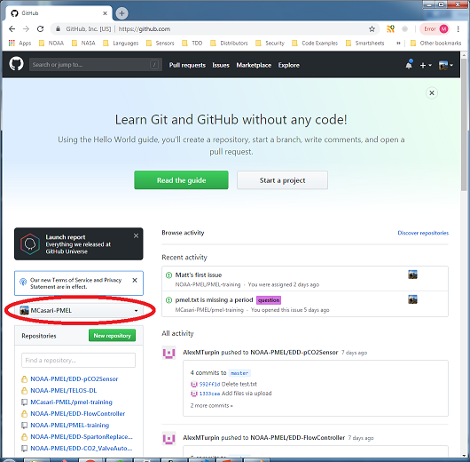
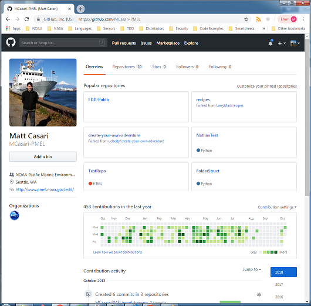
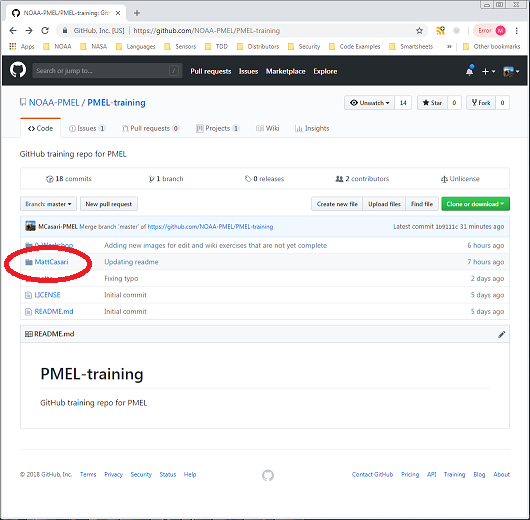
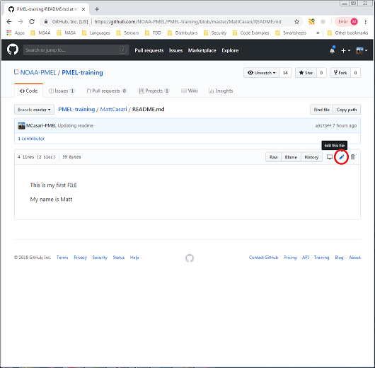
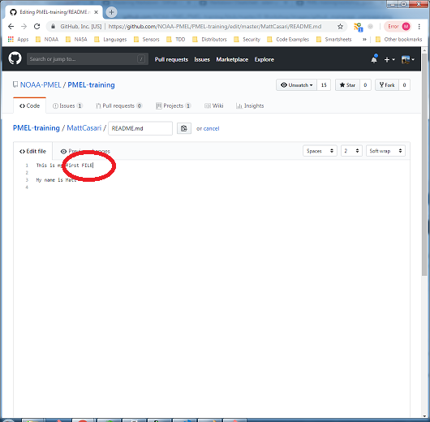
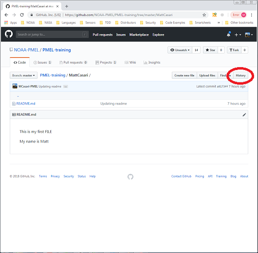
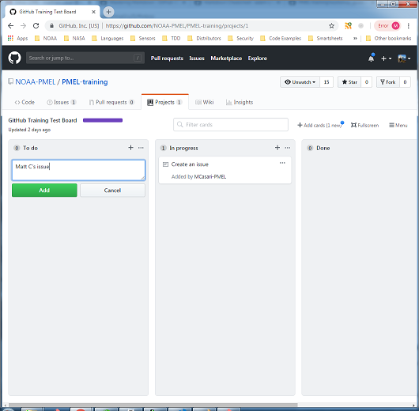
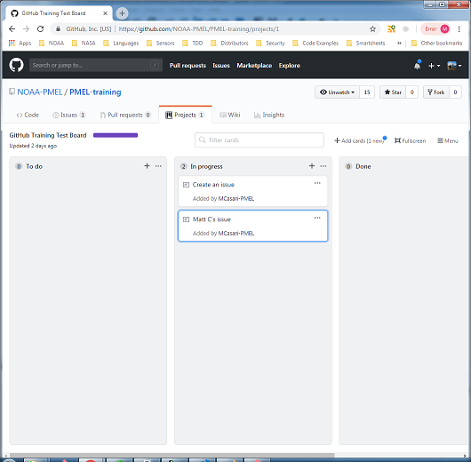
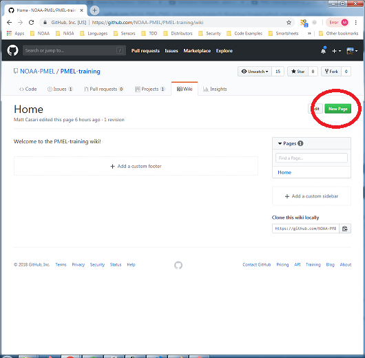
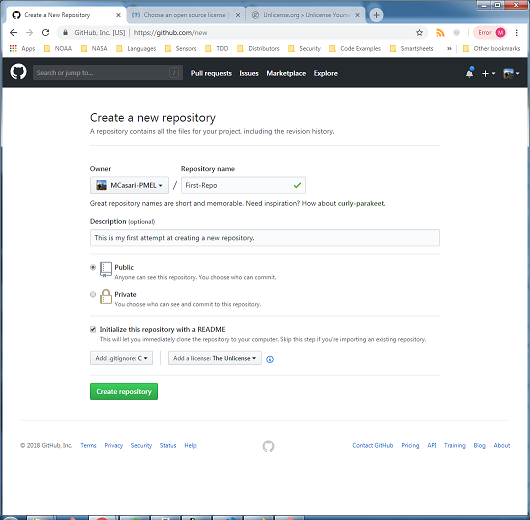

# GitHub Training - Hands-on Workshop
Matt Casari 
NOAA/PMEL/EDD 
matthew.casari@noaa.gov

## Overview
This training is split up into the following subsections:

1. GitHub Website and Navigation
2. Working in an existing repository
3. Project Management tool
4. Issue tracking
5. Creating a wiki
6. Creating a repository
7. Other tools
8. Resources

   

--------------

## 1. GitHub Website and Navigation

The GitHub website more than just the cloud storage site for a project repository.  GitHub has many powerful tools that provide the user the ability to update, modify and view documenation and code.  Additionally, the issue tracking and project management tools make it an effective site to perform project management tasks on a (relatively, with training) easy to use website.

You can access GitHub by going to: 
www.github.com

As NOAA and CI employees, you *must* have a GitHub account which is tied to your @noaa.gov email address.  Your GitHub account can then be tied to the **NOAA-PMEL** account, giving you access to all of PMELs repositories and the ability to create Private repos.

1. **User Site vs. NOAA-PMEL**
      All work being accomplished under a funded NOAA project **MUST** be commited to a repository on the **NOAA-PMEL** page.    

    Work performed for personal use, tutorials, example code, etc. may be saved in repositories on your personal GitHub page.

    To change from your personal page to the NOAA-PMEL page, click on the switch dashboard content dropdown, seen here:

      

1. **Your Profile**
        

    To access your profile page, select the dropdown menu in the upper right-hand corner of your webpage
    with your icon.  From this page you will see your public profile which includes which repositories you work in, and any information about yourself you may provide.

      

    
1. **Settings**
        

    Your settings page controls your access to GitHub, security and other configurations.

    NOAA requires Two-Factor Authentication (TFA) on the GitHub website.  To set this up, select "Security" from the "Personal Settings" list:

      

   

--------------

##  2. Working in an existing repository
In this exercise, you will create a file within an existing repository, located here:

Training Repository: 
https://github.com/NOAA-PMEL/PMEL-training

  

1. Click "Create new File" 
      

2. Create a new folder and filename with format "YourName/README.md" 
    To create a new folder, type "Foldername/" in the path form.  Finish the line with "README.md" 
      

3. Add two lines of text into the edit new file form.  Intentionally make a mistake in one word. 
      

4. Scroll down and fill in the "Commit Changes" forms.
    It is important to be descriptive in the commit changes message (and later when commiting in Git) since this 
    message can be used to help you roll back your code to earlier states. 
    Press "Commit new file" when complete. 
      

At this point you have committed your first file to a repository.  If you followed the instructions, you will 
remember that there was a type in README.md.  Lets go fix it.

5. Go into the folder you created (your name) 
      

6. Click on the README.md file.   
      

7. Click on "Edit" icon  
      

8. Fix the typo 
      

9. Scroll down and fill in "Commit changes block" 
      

10. Press "Commit changes" and you will be returned to the folder view. 
      

Now you have finished editing and committing the new changes.  GitHub has a tool to help you visualize what you have changed.  Lets explore this:

11. Navigate to the file you just changed (if you're not there already).  Click on "History" 
      

12.  This will bring up the commit history for that file.  On the right hand side, you will see a seven 
digit alphanumeric code.  This is referred to as the "commit hash" and it is a truncated version of the 40-digit
SHA-1 hash code generated during the commit process.  Click on the most recent hash to open. 
      

13. The resulting screen is a "Diff"(or difference) of the most recent commit and the previous commit.  Green fields with "+" represent added text, while red fields with "-" represent removed text. 
      

The "Diff" tool is extremely useful in determining what has changed from commit to commit.  In this GUI form, it
is good for seeing changes in documentation.  When used with the Git client it is a powerful tool for determining accidental code changes and quickly determining where to roll back the code to.

At this point, you have created and modified a file within a repository in GitHub. 

   

--------------

## 3. Project Management tool

The Project Management tools within Github allow project managers and project maintainers to have a visual tool for keeping track of tasks within a project.  The format used in GitHub is a Kanban board.  In essence, a Kanban board is a columnar progress chart.  For the most basic Kanban board there would be three columns; "To Do", "In Progress" and "Done".  

For this exercise, you will be creating a task in an existing project.  You will then move the task from "To Do" to "In Progress".

1. Locate the "Projects" tab and click on it 
     

2. Select the "GitHub Training Test Board" 
     

3. Create a task within the "GitHub Training Test Board" project 
      
      

    Click "Add" when you're done filling in the issue

4. Drag that task to "In progress" 
      

5. Complete! 
      

   

--------------

## 4. Issue tracking
The GitHub issue tracker is a fantastic way to track software bugs, enhancements your project needs, places you
need help in the project, and questions about the project that need answers.  

In this exercise, you will create an issue, assign it to someone (Eugene, perhaps), label the issue and add it to a project from the project management tool.

1. Go to the Issues tab 
     

2. Create a new issue 
     

3. Complete the issue form.  Be descriptive! 
      

4. When you're done with the form, press "Submit new issue".  Your issue is now submitted. 
      

5. Assign someone to the issue using the "Assignees" edit tab 
     

6. Apply a label to the issue using the "Label" edit tab 
      
    
7. Add the issue to a project using the "Project" edit tab 
      

1. You have completed creating an issue! 
      

   

--------------

## 5. Creating a wiki
A Wiki is a great place to keep information about a project for easy reference on the website.  In this exercise, you will create a new Wiki and work with the Markdown language to generate a simple but nicely formatted web page.

1. Navigate to the Wiki 
      
    
2. Create a new page 
     

3. Use Markdown to create formatted text 
      

4. Press "Save page" and admire the results 
      

   

--------------

## 6. Creating a repository
Eventually, you will want to create your own repository.  This step is fairly simple, but you must remember that all funded NOAA work must be created within the **NOAA-PMEL** page.  

The task of creating a repository is fairly straightfoward.  In this execise, you will create a new repository within our personal account to minimize how many training repositories end up in **NOAA-PMEL**

1. From your dashboard, select "+" > "New Repository" 
    

2. Fill out the fields based on what you want your repository to reflect 
   
      
    1. Adding a description is useful for external users to understand what the project or code does
    2. Public vs. Private: Private repos cost PMEL $, so use Public as much as you can.
    3. Initializing with a README is good practice.
    4. Add a license:  For code that you are willing to share openly, the Unlicense is a good choice.
    5. Add .gitignore: This sets up your repository to ignore files generated by compilers, tools, etc. that are not required in the repository.
3. Press "Create repository".  You have now created a new repo! 
      
4. To Clone a repo (use it from Git tool) click on the "Clone or download" button. 
   
      

    1. Copy the link and use with your Git tool on your desktop or server to interact with this GitHub repository.  
   
      

   

--------------

## 7. Other tools - Explore on your own
1. Git Gist
2. Marketplace
3. Search tool -> Explore thousands of repos for free!

   

--------------

## 8. Resources 
### GitHub Tutorials
* Introduction to GitHub 
  https://services.github.com/on-demand/intro-to-github/

* GitHub Hello World 
  https://guides.github.com/activities/hello-world/

### Git & GitHub Tutorials
* How to Use Git and GitHub - Version Control for Code 
  https://www.udacity.com/course/how-to-use-git-and-github--ud775

* Git & GitHub Crash Course for Beginners 
  https://www.youtube.com/watch?v=SWYqp7iY_Tc

### Markdown
* GitHub Mastering Markdown 
https://guides.github.com/features/mastering-markdown/

* Markdown Cheatsheet  
https://github.com/adam-p/markdown-here/wiki/Markdown-Cheatsheet#images